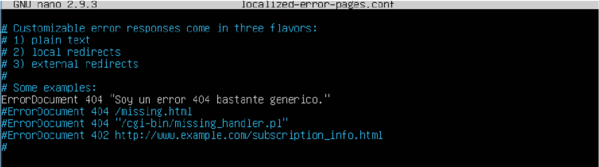

1. Personalizar los ficheros de log.

    a) Muestra la configuración por defecto de los ficheros de log

    b) Para facilitar controlar los accesos a los distintos servidores virtuales, asigna un fichero de access.log diferente y personalizado para cada uno.

    c) Personaliza también el error.log

2. Páginas de error personalizables.

Ayuda para Apache : Páginas de error personalizables ([openwebinars.net — servidor-apache/3359/](https://openwebinars.net/accounts/login/?next=/academia/aprende/servidor-apache/3359/)

2.1. Indica los códigos de respuesta-error más comunes (404, 403, 500 etc) y su significado.
[Ayuda en doc de moodle HTTP: Versiones, Códigos de respuesta...URL](https://es.wikipedia.org/wiki/Anexo:C%C3%B3digos_de_estado_HTTP)

    404: Not Found
    Aparece cuando el servidor no encuentra el recurso solicitado. Por ejemplo, si se escribe una URL incorrecta o si se intenta acceder a un archivo que no existe.

    403: Forbidden
    Aparece cuando el servidor rechaza el acceso al recurso solicitado. Por ejemplo, si se intenta acceder a un archivo que no tiene permisos de lectura.

    500: Internal Server Error
    Aparece cuando el servidor encuentra un error interno que no puede resolver. Por ejemplo, si se intenta acceder a un archivo que no tiene permisos de lectura.

2.2. En la práctica anterior , al prohibir el acceso a un archivo, este error queda registrado en un archivo de log. Vuelve a provocarlo y captura el registro.

2.3. Vamos a personalizar los mensajes de error de nuestro site.
Por defecto, cuando el servidor tiene que devolver un código de error, el comportamiento será el indicado en la configuración general de servidor web (Nginx o Apache).
Esta configuración afecta a todos los sites del servidor excepto que se especifique una configuración concreta en ellos.
Como podemos ver en este fichero, la configuración puede ser mostrando un simple texto o redireccionando a una página local o a una URL.

2.4. Configura el error 404 en uno de tus sites (en el .conf del site) de modo que se muestre una página de error como se indica aquí:

error_page 404 /errores/error404.html 

Recuerda que el "/" en la ruta es relativa al Root establecido en cada site. Por tanto ten cuidado con dónde ubicas el archivo de error . Segun este ejemplo deberías haber creado un directorio "errores" debajo

2.5 ¿Puedes personalizar los errores en un "/location" (/Directory)? Demuéstralo