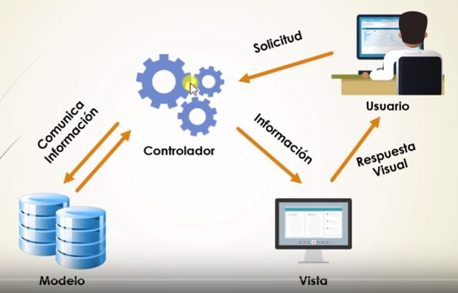

# CUESTIONARIO Tema 3: Conceptos sobre servidores de aplicaciones.

Contesta tras leer la documentación .pdf del tema (3.1 a 3.5) y mira el vídeo de MVC:

## 1. Define 'Servidor de aplicaciones' e indica algunos de los más usados. Da datos actuales

```ini
Servidor de aplicaciones es un servidor que ejecuta aplicaciones. Los más usados son Tomcat, JBoss, Glassfish, Weblogic, WebSphere, etc.

```

## 2. Indica la diferencia entre Servidor de App y un Web Container o servlet container.

```ini
Un servidor de aplicaciones es un servidor que ejecuta aplicaciones. Un web container o servlet container es un componente de un servidor de aplicaciones 
que ejecuta servlets y JSPs.

```

## 3. Comparativa CGI y Servlet: en qué lenguaje están programados, qué pueden contener, dónde se pueden ejecutar, en qué parte del MVC estarían ...

```ini
CGI está programado en lenguaje C. Pueden contener código HTML. Se ejecutan en el servidor web. Estarían en la capa de presentación del MVC.

Los servlets están programados en Java. Pueden contener código HTML. Se ejecutan en el servidor de aplicaciones. Estarían en la capa de 
presentación del MVC.

```

## 4. Define brevemente : applet, J2EE, J2SE, JSP, servlet, EJB y JDBC

```md
Applet es un programa que se ejecuta en el navegador web.

J2EE es el estándar de Java para aplicaciones empresariales.

J2SE es el estándar de Java para aplicaciones de escritorio.

JSP es un lenguaje de programación que se ejecuta en el servidor de aplicaciones.

Servlet es un componente de un servidor de aplicaciones que se ejecuta en el servidor de aplicaciones.

EJB es un componente de un servidor de aplicaciones que se ejecuta en el servidor de aplicaciones.

JDBC es una API que permite acceder a bases de datos.

```

## 5. DIBUJA UN ESQUEMA (papel o digital) en el que se represente la estructura de una aplicación web de modo que aparezcan representados TODOS los siguientes elementos:

- navegador web,
- applets,
- JavaScript,
- servidor de aplicaciones y/o web container(Tomcat) ,
- servlet,
- JSP
- y un servidor de BBDD.
   Nota: puedes ayudarte del dibujo que se adjunta.

   

## 6. MVC

### a) Explica las partes del modelo MVC. Después

### b) Pon un ejemplo concreto de lo que estás desarrollando en el módulo de Desarrollo Web entorno Servidor : enumera las clases que defines en cada parte del modelo

Nota: si lo tienes, hazlo sobre una aplicación web que fuese capaz de multiplicar dos números (ver vídeo en moodle sobre MVC)
