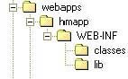

# Vamos a realizar el despliegue de otra aplicación pero ahora usando la herramienta de gestión de Tomcat.

Introducción

Una aplicación Web Java se compone de una estructura estándar jerárquica de directorios y archivos. Dicha estructura puede encontrarse desempaquetada o empaquetada como una Web ARchive (.war).

El desempaquetado se usa para desarrollo mientras que el empaquetado para distribuir la aplicación en entornos de producción.

Para desplegar una aplicación web existen dos métodos:

1.  Usando el gestor de aplicaciones Tomcat Manager.

    Este método lo usamos en la práctica anterior; permite desplegar y eliminar aplicaciones sin necesidad de reiniciar el servidor Tomcat. Hay que indicar la ruta relativa donde se encuentra la aplicacion en el campo URL y la ruta de archivo de configuración XML si es necesaria.

2.  Por terminal: Sólo hay que compiar la estructura desempaquetada (.war) en el directorio $CATALINA_HOME\webapp reiniciar Tomcat. Ésto hará que se despliegue automáticamente.

## PARTE 1: Despliegue usando Tomcat Manager.

1. Antes de empezar recuerda el directorio en el que se despliegan las aplicaciones (WEBAPPS). Indica los subdirectorios que contiene y los principales ficheros de configuración.

2. Descargar el archivo "sample.war" de esta URL en el directorio que desees.

3. Abrir desde el navegador el Tool Manager de Tomcat. Baja por la página hasta que veas "Archivo WAR a desplegar" y pulsa en "Examinar...".

4. Seleccionar el archivo .war descargado y pulsar 'Desplegar'

5. Capturar pantalla del gestor (o mostrar al profesorado) con el listado de aplicaciones entre las cuales debe aparecer la que acabamos de desplegar.

6. Pulsar sobre el enlace para acceder a la aplicación.

7. Capturar pantalla del terminal (o mostrar al profesorado) mostrando la estructura de directorio de Tomcat y Apache en la que ha habido cambios debido al despliegue realizado tanto en esta como en la práctica anterior.

## PARTE 2: Despliegue por consola.

En este ejercicio vamos a usar el segundo método.

Procedimiento

1. Descarga la siguiente app para tu versión de Tomcat : EjemploPruebaCarga.war

2. Copiar el .war descargado en la carpeta de aplicaciones de Tomcat ( $CATALINA_HOME\webapps). Reinicia Tomcat y verás que se despliega la app automáticamente.

3. Observa la estructura de directorios creada.

Ha debido crear una estructura de directorios como esta (en este ejemplo la aplicacion se llama hmapp):

4. Busca los archivos de configuración context.xml, server.xml y web.xml .

   Nota: Recuerda que si una aplicación no tiene su propio fichero context.xml, Tomcat lee el general ubicado en el raiz de Tomcat. Igual ocurre con el web.xml

Muestra el contenido del archivo web.xml y observa la configuración para un servlet y su mapeo

5. Verificar la salida deL web container en el archivo $CATALINA_HOME/logs/catalina.out con el comando tail

6. Ejecuta la app.
