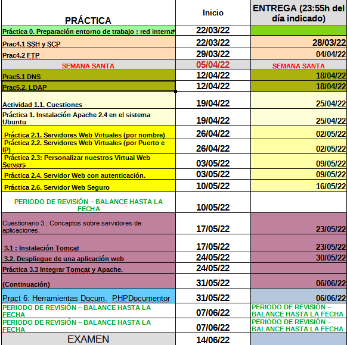

R E C U P E R A C I O N E S

Nuevo horario:  Miércoles 3ra y 4ta hora
Información importante durante el periodo de clases no presenciales:   
 - LA ASISTENCIA ES OBLIGATORIA
- Las dudas se resolverán en horas de clase en la medida de lo posible. 
-  Las prácticas y ejercicios se mostrarán funcionando en horario de clase. NO SE ADMITIRÁ LA ENTREGA DE UNA PRÁCTICA SI NO HA SIDO REVISADA PREVIAMENTE POR LA PROFESORA.
- Se respetará la fecha de entrega indicada en cada tarea Y NO SE PERMITIRÁ EL RETRASO. En caso de retraso se superará el RA a través de una prueba escrita/examen.

